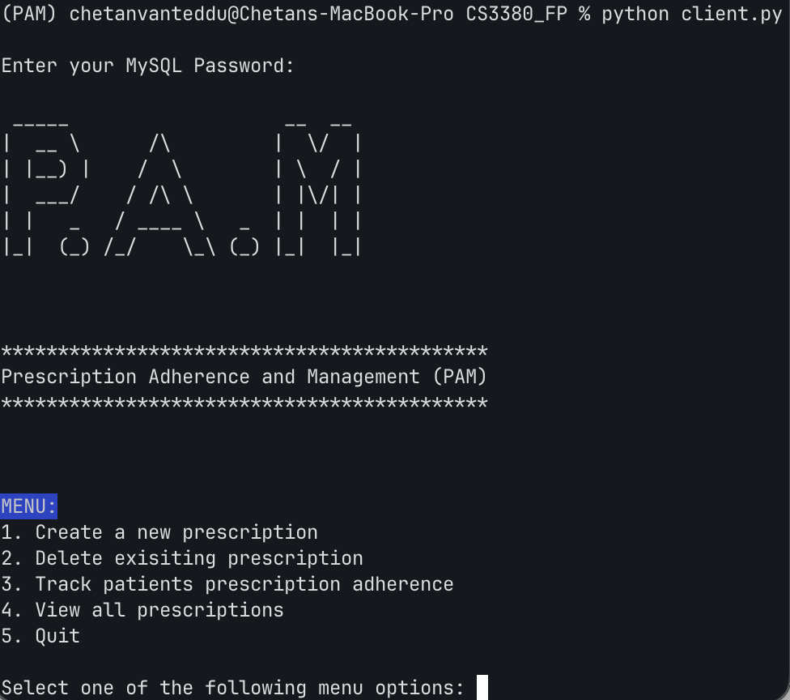

# Prescription-Adherence-and-Medication (PAM) - CMP_SC 3380 Final Project

# About

Problem Statement: The application I am designing will help care teams at hospitals better manage their patients’ medication by being able to monitor their patients’ medication adherence and medications. This will allow care team specialists to create and delete an existing patient's prescriptions, as well as check up on a patient's adherence to prescription.

# Libraries

- `mysql-connector-python`
- `pandas`
- `DateTime`
- `colorama`
- `pyfiglet`

# Setup

1. Open a new terminal/cmd window and cd into the directory where you cloned this application
2. Create and activate a Conda environment for the project: run `conda create -n PAM python=3.12 -y` then `conda activate PAM`
3. Install the required libraries into this environment: `python -m pip install mysql-connector-python pandas DateTime colorama pyfiglet`
4. With your local MySQL server already running, initialize the database by running from the project directory: `mysql -u root -p < Patient_MedicationDB.sql`
5. From the same terminal/cmd window, start the app with `python client.py`
